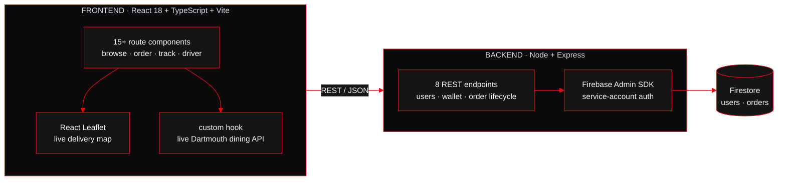

<!-- ════════════════════════════ HERO ════════════════════════════ -->

<div align="center">


&nbsp;

[](https://swabir.com)
[](https://www.linkedin.com/in/swabir-mohamed-927086271/)
[](mailto:swabir.m.bwana.27@dartmouth.edu)

</div>

<!-- ════════════════════════════ 01 ════════════════════════════ -->


I write software and firmware, and I don't treat them as two separate careers. Some weeks that means a React and Node platform with real users hitting it in production. Other weeks it's an interrupt handler on a Cortex-M0 where the entire job is shaving microseconds. The engineers I learn the most from are comfortable on both sides of that line, so that's where I'm trying to stand.

|  |  |
|:--|:--|
| **PROGRAM** | Engineering Sciences modified with Computer Science · Thayer School of Engineering |
| **BASE** | Hanover, NH · originally from Mombasa, Kenya |
| **SHIPPING** | QlikShift, a production shift-scheduling SaaS running inside Dartmouth Library |
| **TEACHING** | TA · CS10 Object-Oriented Programming · previously ENGS 28 Embedded Systems |
| **OPEN TO** |  software engineering · firmware · systems · hardware-software integration |

<!-- ════════════════════════════ 02 ════════════════════════════ -->


<a href="https://github.com/dartmouth-cs52-25S/project-swipe-plate"></a>

Campus food delivery across all four Dartmouth dining halls, where students order and other students deliver. I led a team of four from an empty repo to a deployed product in six weeks, and built both halves myself: two decoupled repos wired to the real campus dining API rather than mock JSON.



<a href="https://github.com/Swabir001/tse-Swabir001"></a>

Three separate C programs that pipe into each other, with nothing external doing the hard parts.


Underneath all three sit four structures I wrote from scratch and reused across the whole course: a bag, a set, named counters that increment instead of erroring on duplicates, and a hashtable of sets for O(1) average lookup. Every `malloc` paired, every NULL input checked, every module clean under valgrind.

<a href="https://github.com/Swabir001/nuggets-group-6"></a>

Real-time multiplayer dungeon game over a custom UDP protocol. The server owns everything: map layout, player positions, where the gold is scattered. Clients are terminals that send keypresses and receive live ncurses frames back. Per-player line of sight gets recomputed on every single move, which is where the actual difficulty lives.

<a href="https://github.com/Swabir001/studyPod"></a>

Match with classmates by course, study style, and availability. Socket.io broadcasts a "studying now" signal to relevant matches, JWT handles auth, and a reliability reputation system means chronic no-shows get filtered out over time rather than wasting everyone's afternoon.


Two backends on one foundation, aimed at different problems. A blog platform with full CRUD, and a multiplayer Wordle API managing sessions, guesses, and win/loss state across concurrent games. Schema defined in Prisma, migrations run properly rather than hand-edited, endpoints tested end to end with Cypress.

<a href="https://github.com/Swabir001/swabflix"></a>

SwabFlix is a streaming-style interface on live TMDB data: season and episode browsers, watch history, ranked rows, skeleton loading states, responsive down to phone width. Street Food Atlas is a CRUD recipe platform on React Router v7 data mode, where loaders prefetch per route and actions trigger automatic revalidation after writes. Zustand holds the client-only state, including an edit draft so cancelling never destroys the original record.

<!-- ════════════════════════════ 03 ════════════════════════════ -->


<a href="https://github.com/Swabir001/marble-maze"></a>

A physical tilt-to-navigate LEGO maze on an STM32C031C6TX. Joystick ADC drives two NEMA steppers to tilt the platform, an I²C display counts down thirty seconds, and interrupt-driven sensors on PA5/PA6 catch the finish line. The real design work was the four-state machine and a 200-unit ADC deadzone, tuned to kill joystick jitter without making the controls feel dead. Interrupt architecture instead of polling kept motor response under 10ms.


Rather than running inference in software, I synthesized it into logic. C with HLS annotations went through Vitis HLS into RTL, then into Vivado alongside the ARM core, connected over AXI. I wrote the driver on the processor side and ran co-simulation to prove hardware and software agreed on every test vector. Then I optimized and tracked what happened: loop unrolling, `PIPELINE II=1`, AXI Stream for continuous feed, with latency, initiation interval, and LUT/FF/BRAM/DSP usage logged at every step. The lesson was watching the bottleneck migrate off the accelerator and onto memory bandwidth.


Everything that happens before `main()` is called. Startup code copying `.data` from flash into RAM, zeroing `.bss`, setting the stack pointer, laying out the interrupt vector table. Custom linker scripts placing code and data exactly where I wanted them, and C and assembly calling into each other. Then I stripped floating point out of a neural network entirely, because cheap microcontrollers emulate float in software and pay dearly for it: float32 weights quantized to int8 with scale factors, sigmoid swapped for a lookup table. Same predictions, a fraction of the flash and cycles, measured both ways rather than assumed.


Human activity recognition, full lifecycle on real silicon. I collected three-axis motion data over SPI, trained a classifier in Python, converted the weights to C arrays, deployed inference on the STM32, then measured accuracy against latency and memory footprint on the actual chip. That last step is the one most ML coursework skips. The accelerometer driver is interrupt-driven rather than polled, so the chip raises an interrupt when data is ready and the CPU touches it only then. Separately I programmed an ESP32-C3 as a BTLE-to-UART bridge, so a plain serial device goes wireless without knowing BTLE exists.

<!-- ════════════════════════════ 04 ════════════════════════════ -->


<details>
<summary><b>&nbsp;CS50 · Software Design & Implementation &nbsp;<code>C · systems</code></b></summary>
<br/>

No garbage collector, no frameworks, no hand-holding. Everything designed, implemented, tested, and documented.

**Data structures from scratch.** Bag as a manually managed linked list. Set as a string-keyed store with no duplicates. Counters, where inserting an existing key increments rather than errors. Hashtable as a fixed array of sets with a hash function mapping keys to buckets. Unit test drivers and regression scripts for each, then reused throughout the projects above.

**Tiny Search Engine.** Crawler, indexer, querier as three piping programs. Detailed in section 02.

**Nuggets.** 26-player UDP game server and clients. Detailed in section 02.

**Collaborative graphical editor.** Multi-threaded Java client-server drawing tool where multiple clients edit one shared canvas.

`linked lists` `hash functions` `dynamic allocation` `function-pointer iterators` `defensive programming` `modular headers` `valgrind`

</details>

<details>
<summary><b>&nbsp;CS52 · Full-Stack Web Development &nbsp;<code>React · Node · Postgres</code></b></summary>
<br/>

Started at raw HTML and CSS, added one layer of the stack per assignment.

**Responsive landing page.** Semantic HTML and Flexbox, debugged live in DevTools. Learning how browsers actually lay out and paint a page.

**Async DOM quiz.** A "what city should you live in" personality quiz in jQuery. Questions in a JSON file loaded asynchronously, which meant handling callback ordering so the DOM was ready before populating it. Deployed static on Render.

**Notes app.** First React project. Components, props flowing down, state triggering re-renders, callbacks handed to children.

**Street Food Atlas.** React Router v7 data mode with loaders and actions, Zustand for client-only state. Detailed in section 02.

**Blog API and Wordle API.** Express, Prisma, PostgreSQL, Cypress. Detailed in section 02.

**SwipePlate.** Final project, two repos, real users. Detailed in section 02.

`DOM & events` `async JSON` `component composition` `loaders/actions` `ORM migrations` `E2E testing` `deployment config`

</details>

<details>
<summary><b>&nbsp;ENGS 62 · Microprocessors in Engineered Systems &nbsp;<code>embedded C · ARM · FPGA</code></b></summary>
<br/>

Programming computers at the hardware level: processor architecture, peripherals, memory layout, then designing custom accelerators.

**Bit manipulation and QEMU workflow.** Hex arithmetic, shifts and masks to set, clear, and toggle individual register bits, function pointers. Cross-compile for ARM and run in emulation for fast iteration before touching real chips.

**Neural network in C on a microcontroller.** Trained XOR in Python for the weights, then reimplemented the forward pass in C by hand: multiply, bias, sigmoid, threshold. First contact with TinyML.

**ARM assembly and bare-metal startup.** Thumb instructions directly, fetch-decode-execute, registers and stack, then linker scripts and the full pre-`main()` sequence.

**Quantization.** Same network with all floating point removed, measuring code size, RAM, and execution time both ways.

**BTLE bridge, SPI driver, activity recognition, FPGA accelerator, HLS optimization.** All detailed in section 03.

`register-level C` `cross-compilation` `Thumb asm` `linker scripts` `fixed point` `SPI/USART/ADC` `HLS` `AXI` `pipelining vs resources`

</details>

<details>
<summary><b>&nbsp;Everything else on the transcript</b></summary>
<br/>

| course | what it covered |
|---|---|
| **CS10** · [repo](https://github.com/Swabir001/cs10-java-oop-data-structures-and-algorithms) | Java OOP, data structures, graph search, client-server, multithreading. I now TA this course. |
| **COSC 61** · Database Systems | Relational modelling, SQL, query planning, normalization. |
| **ENGS 28** · Embedded Systems | STM32 firmware, GPIO, UART, SPI, I²C, ADC, interrupt architecture. TA'd it the following term. |
| **ENGS 31** · Digital Electronics | VHDL on Basys 3, K-map minimization, FSM design, SPI transmitter, ripple-carry adder, digital combination safe. |
| **ENGS 20** · Scientific Computing | MATLAB, numerical methods. |
| **ENGS 21 / 22 / 23 / 25 / 30** | Engineering design, systems, distributed systems, thermodynamics, biological physics. |
| **MATH 8 / 13 / 14 / 22 / 23** | Multivariable calculus, linear algebra, differential equations. |
| **PHYS 13 / 14 · CHEM 5** | Mechanics, electricity and magnetism, general chemistry. |

</details>

<!-- ════════════════════════════ 05 ════════════════════════════ -->


<div align="center">


<br/>


</div>

```
LANGUAGES    C · C++ · Python · Java · TypeScript · JavaScript · SQL · ARM Thumb asm · VHDL
WEB          React · Next.js · Node · Express · Prisma · Firebase · Postgres · Mongo · Tailwind
EMBEDDED     STM32 · Cortex-M0+/M4 · FreeRTOS · SPI/UART/I²C · ADC/PWM/GPIO · BTLE · ESP32-C3
FPGA / ML    Vitis HLS · Vivado · AXI Stream · TensorFlow · scikit-learn · int8 quantization
TOOLING      Git · Docker · GDB · Valgrind · QEMU · Cypress · JTAG/SWD · logic analyzer · SolidWorks
```

<!-- ════════════════════════════ 06 ════════════════════════════ -->


Standard PEDOT:PSS-on-gold implants delaminate under cyclic stimulation, so the goal is removing the metal interface entirely. I run the fabrication workflow — photolithography, spin-coating, parylene-C CVD, RIE — and characterize with EIS and CIC testing across repeated stimulation cycles. Regenerative Bioelectronics Lab, supervised by Prof. Alex Boys. Manuscript in preparation.

|  |  |
|:--:|:--|
| 🏆 | **2024 Louis J. Setti International Intern Award**, for the E.E. Just research placement |
| 📄 | **Co-author**, 45th SICOT Orthopaedic World Congress, Spain 2025 — global participation in pediatric hand surgery |
| 🎓 | **E.E. Just Undergraduate Fellow** · **FYSEP STEM Academic Fellow** |
| 🇰🇪 | **KenSAP Coding Instructor** — taught Python to Kenyan scholars headed to US universities |

<!-- ════════════════════════════ 07 ════════════════════════════ -->


<table>
<tr>
<td width="33.3%"></td>
<td width="33.3%"></td>
<td width="33.3%"></td>
</tr>
</table>

Badminton, swimming, and whatever New Hampshire has open for hiking. I once lost an embarrassing amount of time to the question of why a cow is called a cow and not a goat. Who made that sound first, and why did everyone else go along with it. My friends tolerate this. It's also exactly why I'm decent at root cause analysis.

<div align="center">

&nbsp;


[](mailto:swabir.m.bwana.27@dartmouth.edu)

&nbsp;

</div>
